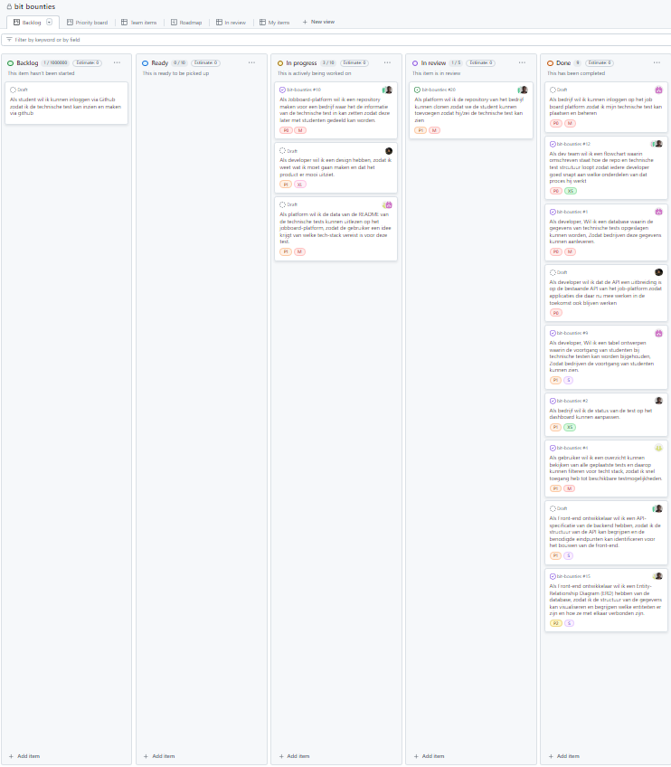

# Bit Bounties - Projectomschrijving en user stories

## Algemene informatie
 Naam opdrachtgever: Joris Schelfhout

Project manager: Ties Noordhuis

Naam project: Bit Bounties

## Project Doel
Het verbeteren van het huidige NexEd job-board door een platform te bieden waar bedrijven technische tests (bounties) kunnen plaatsen. Studenten kunnen door het succesvol voltooien van deze tests een stageplek verdienen.

## Eisen en Wensen van de Klant

- Bedrijven kunnen technische tests plaatsen met relevante informatie.
- Studenten kunnen een stageplek verdienen door het succesvol voltooien van de tests.
- Overzicht van bedrijven en de bijbehorende technische tests, filterbaar op tech stack.
- Technische tests uitvoerbaar via een private GitHub repository.
- Inlogfunctionaliteit voor bedrijven via het job-board en voor studenten mogelijk via GitHub.
- Opslag van technische tests in Markdown-formaat.
- **Bonus**: Integratie van OpenAI voor het genereren van technische tests gebaseerd op de tech stack van het bedrijf.

## De gebruikte technieken

### Talen

- TypeScript
- JavaScript
- HTML
- CSS
- PHP

### Frameworks en Libraries

- Next.js (React)
- TailwindCSS
- OAuth 2.0
- Axios
- react-feather
- Formik
- Laravel
- Filament
- MySQL

---

## Overzicht van User Stories

### Overzicht
De hieronder beschreven user stories vertegenwoordigen de eisen en wensen van onze klant, vertaald naar specifieke functionaliteiten die ontwikkeld moeten worden voor het Bit Bounties platform. Elke story is essentieel voor het leveren van een product dat voldoet aan de verwachtingen van de gebruikers.

### Tijdsindicaties
Om ons project effectief te beheren, gebruiken we tijdsindicaties voor elke user story. Deze indicaties helpen bij het inschatten van de benodigde tijd en middelen voor de ontwikkeling:

- **S (Klein)**: Overeenkomt met één dag werk - taken die snel afgehandeld kunnen worden.
- **M (Medium)**: Een halve sprint - taken die doorgaans ongeveer 2 tot 3 dagen duren.
- **L (Groot)**: Een volledige sprint - meer omvangrijke taken die een hele week vereisen.
- **XL (Extra Groot)**: Anderhalve tot twee sprints - voor de meest complexe taken die uitgebreide inspanningen vereisen.

Elke sprint in ons project wordt gedefinieerd als een periode van één week, waarin het team zich richt op het voltooien van de toegewezen user stories binnen deze tijdframes.

Deze gestructureerde aanpak zorgt voor een efficiënte workflow en helpt het team bij het prioriteren en plannen van taken, waarbij we ervoor zorgen dat elke functionaliteit grondig wordt ontwikkeld en getest voordat deze wordt geïmplementeerd.

| #   | Als (rol):          | Wil ik:                                                                                                  | zodat:                                                                                                             | Realistisch?     | Prioriteit: | Tijdsindicatie |
| --- | ------------------- | -------------------------------------------------------------------------------------------------------- | ------------------------------------------------------------------------------------------------------------------- | ---------------- | ----------- | -------------- |
| 1   | Jobboard-platform   | Een repository maken voor een bedrijf                                                                    | informatie over technische testen opgeslagen en gedeeld kan worden met studenten.                                  | Ja, GitHub API's bieden de nodige functionaliteit voor het creëren en beheren van repositories.  | Hoog        | XL              |
| 2   | Platform            | De data van READMEs van technische tests uitlezen                                                        | gebruikers een overzicht krijgen van vereiste tech-stacks.                                                          | Ja, met behulp van de GitHub API en parsing libraries. | Hoog        | M              |
| 3   | Front-end ontwikkelaar | Een API-specificatie van de backend                                                                      | ik de structuur en benodigde eindpunten voor de front-end ontwikkeling kan identificeren.                           | Ja, het is een standaardpraktijk bij API-ontwikkeling. | Middel      | S              |
| 4   | Dev team            | Een design voor het platform                                                                             | het product er aantrekkelijk uitziet en gebruikersvriendelijk is.                                                    | Ja, afhankelijk van de beschikbaarheid van design resources. | Middel      | L              |
| 5   | Platform            | De repository van een bedrijf kunnen clonen                                                              | We de student kunnen toevoegen zodat hij/zij de technische test kan zien.                                            | Ja, dit is mogelijk met de juiste configuratie en toestemmingen via GitHub. | Hoog        | L              |
| 6   | Back-end ontwikkelaar            | Een tabel ontwerpen voor de voortgang van studenten bij technische testen                                | bedrijven inzicht krijgen in de prestaties en voortgang van studenten.                                               | Ja, basis databasefuncties zijn hiervoor voldoende. | Middel      | S              |
| 7   | Back-end ontwikkelaar | Een Entity-Relationship Diagram (ERD) van de database                                                    | ik inzicht krijg in de datastructuur en relaties tussen de entiteiten.                                               | Ja, een essentiële stap in databaseontwerp. | Middel      | S              |
| 8   | Dev team              | Een flowchart van het proces rondom de repo en technische testen                                         | elk teamlid inzicht heeft in hun rol binnen het proces.                                                              | Ja, helpt bij het visualiseren en communiceren van het proces binnen het team. | Middel      | S              |
| 9   | Back-end ontwikkelaar            | Een database voor het opslaan van gegevens van technische testen                                         | bedrijven deze gegevens kunnen indienen.                                                                             | Ja, basisfunctionaliteit voor elk webplatform. | Hoog        | M              |
| 10  | Dev team            | De API als uitbreiding op de bestaande API van het job-platform                                          | bestaande en toekomstige applicaties naadloos integreren.                                                            | Ja, mits er documentatie en ondersteuning is voor de bestaande API. | Hoog        | L              |
| 11  | Bedrijf               | De status van een test aanpassen op het dashboard                                                        | de voortgang van de test actueel en inzichtelijk is.                                                                 | Ja, vereist een gebruiksvriendelijke UI en database-updates. | Middel      | S              |
| 12  | Student             | Een overzicht kunnen bekijken van alle geplaatste tests en daarop kunnen filteren voor tech stack        | ik snel toegang heb tot beschikbare testmogelijkheden.                                                               | Ja, standaardfunctionaliteit voor veel webplatforms. | Middel        | M              |
| 13  | Student                | Kunnen inloggen via GitHub                                                                               | ik de technische test kan inzien en maken via GitHub.                                                                 | Ja, OAuth authenticatie via GitHub is een gangbare methode. | Hoog        | L             |
| 14  | Bedrijf                | Kunnen inloggen op het job board platform                                                                | ik mijn technische test kan plaatsen en beheren.                                                                     | Ja, essentieel voor platformbeheer en interactie met gebruikers. | Hoog        | M              |

## Definition of Done - Belangrijkste Punten

### Repository Aanmaken voor het Bedrijf (US-1)
- Er is een geautomatiseerd systeem ontwikkeld dat in staat is om voor elk deelnemend bedrijf een eigen GitHub repository te creëren.
- De repository is voorzien van initiële configuratiebestanden, waaronder een standaard README die richtlijnen bevat voor het gebruik en beheer van de repository.

### README Data Uitlezing (US-2)
- Een functie is ontwikkeld die README-bestanden van technische tests kan uitlezen en analyseren.
- De uitgelezen data wordt correct weergegeven in een overzicht op het platform, inclusief technologische stacks en testvereisten.
- Eventuele fouten bij het uitlezen worden afgehandeld en gelogd voor revisie.

### API Specificatie (US-3)
- De API-documentatie is compleet, duidelijk, en toegankelijk voor alle front-end ontwikkelaars.
- Alle eindpunten zijn grondig getest met zowel positieve als negatieve testcases.
- De API voldoet aan de beveiligingsnormen en bevat maatregelen tegen veelvoorkomende beveiligingsrisico’s.

### Repository Cloning Functionaliteit (US-5)
- De functionaliteit voor het clonen van repositories is geïmplementeerd en geautomatiseerd.
- Er zijn duidelijke logs en meldingen voor de status van kloonoperaties.
- De beveiliging van gekloonde data is gewaarborgd door strikte toegangscontroles en encryptie.

### Voortgangstabel (US-6)
- De voortgangstabel wordt in real-time bijgewerkt en is accuraat voor alle gebruikers.
- Er zijn filters en zoekfuncties beschikbaar om specifieke data snel te vinden.
- De tabel is toegankelijk via het hoofddashboard en biedt exportmogelijkheden voor rapportage.

### Entity-Relationship Diagram en Flowchart van Processen (US-7 & US-8)
- Het ERD en de flowchart zijn volledig up-to-date en reflecteren de huidige systeemstructuur.
- Deze documenten zijn gereviewd en goedgekeurd door de systeemarchitect en het ontwikkelteam.
- Wijzigingen in de systeemstructuur worden onmiddellijk bijgewerkt in deze documenten.

[Repository](https://github.com/praxand/bit-bounties)

[Backlog](https://github.com/users/praxand/projects/1/views/1)

Bob is geinvite naar deze repository aangezien dit prive moet zijn van de opdrachtgever (Joris). Het project zit ook in een zip file in deze repository.

