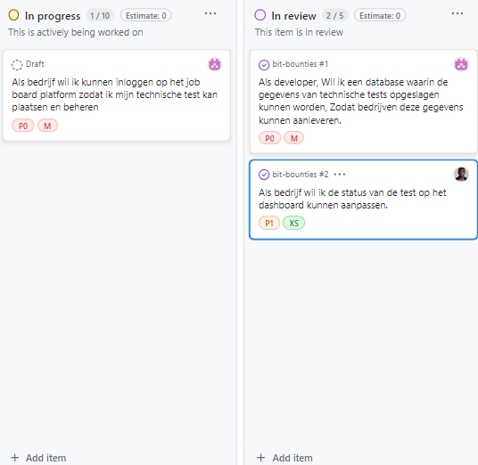

# Bit Bounties - Planning

Deze planning is gemaakt op basis van de eerder gedefinieerde user stories.
## Sprint Planning

| Sprint # | Beschrijving |
|----------|--------------|
| 1        | **Kick-off en Basis Setup**. Focus op het vaststellen van de projecteisen, het maken van het ERD van de database, het opzetten van een GitHub repository, het schrijven van user stories en het creëren van de backlog. |
| 2        | **Ontwikkeling Kernfunctionaliteiten**. Ontwikkeling van inlogfunctionaliteit voor bedrijven op het job-board platform, het opzetten van de database voor het opslaan van technische tests, en het aanpassen van de status van een test op het dashboard. |
| 3        | **Proces Optimalisatie en API Integratie**. Het creëren van een flowchart voor de structuur van repositories en technische tests, het uitbreiden van de bestaande API van het job-platform, en het ontwerpen van een tabel voor de voortgang van studenten bij technische testen. |
| 4        | **Gebruikersinterface en Data Visualisatie**. Ontwikkeling van functionaliteiten om alle geplaatste tests te bekijken en te filteren op tech stack, specificatie van de backend API voor front-end ontwikkelaars, en het afronden van het ERD van de database. |
| 5        | **Repo Management en Data Uitlezing**. Mogelijk maken voor het platform om bedrijfsrepositories te clonen voor studenten, het maken van een repository voor bedrijven voor het plaatsen van technische tests, en het uitlezen van README data van technische tests op het platform. |

## Gedetailleerde Sprint Overzicht

### Sprint 1: Kick-off en Basis Setup

- Eisen van de klant vastgesteld.
- ERD van de database gemaakt.
- GitHub repository opgezet.
- User stories geschreven.
- Backlog gecreëerd.

### Sprint 2: Ontwikkeling Kernfunctionaliteiten

- **User Stories Afgerond**:
  - Als bedrijf wil ik kunnen inloggen op het job board platform zodat ik mijn technische test kan plaatsen en beheren.
  - Als developer, wil ik een database waarin de gegevens van technische tests opgeslagen kunnen worden, zodat bedrijven deze gegevens kunnen aanleveren.
  - Als bedrijf wil ik de status van de test op het dashboard kunnen aanpassen.

### Sprint 3: Proces Optimalisatie en API Integratie

- **User Stories Afgerond**:
  - Als dev team wil ik een flowchart waarin omschreven staat hoe de repo en technische test structuur loopt zodat iedere developer goed snapt aan welke onderdelen van dat proces hij werkt.
  - Als developer wil ik dat de API een uitbreiding is op de bestaande API van het job-platform zodat applicaties die daar nu mee werken in de toekomst ook blijven werken.
  - Als developer, wil ik een tabel ontwerpen waarin de voortgang van studenten bij technische testen kan worden bijgehouden, zodat bedrijven de voortgang van studenten kunnen zien.

### Sprint 4: Gebruikersinterface en Data Visualisatie

- **User Stories Afgerond**:
  - Als gebruiker wil ik een overzicht kunnen bekijken van alle geplaatste tests en daarop kunnen filteren voor tech stack, zodat ik snel toegang heb tot beschikbare testmogelijkheden.
  - Als Front-end ontwikkelaar wil ik een API-specificatie van de backend hebben, zodat ik de structuur van de API kan begrijpen en de benodigde eindpunten kan identificeren voor het bouwen van de front-end.
  - Als Front-end ontwikkelaar wil ik een Entity-Relationship Diagram (ERD) hebben van de database, zodat ik de structuur van de gegevens kan visualiseren en begrijpen welke entiteiten er zijn en hoe ze met elkaar verbonden zijn.

### Sprint 5: Repo Management en Data Uitlezing

- **User Stories Afgerond**:
  - Als platform wil ik de repository van het bedrijf kunnen clonen zodat we de student kunnen toevoegen zodat hij/zij de technische test kan zien.
  - Als Jobboard-platform wil ik een repository maken voor een bedrijf waar het de informatie van de technische test in kan zetten zodat deze later met studenten gedeeld kan worden.
  - Als platform wil ik de data van de README van de technische tests kunnen uitlezen op het jobboard-platform, zodat de gebruiker een idee heeft van de technische test.

## Overzicht User Stories per Sprint

| Sprint 1 | Sprint 2  | Sprint 3 | Sprint 4  | Sprint 5  |
|----------|-----------|----------|-----------|-----------|
|     | US-14     | US-08    | US-12     | US-05     |
|    | US-09     | US-10    | US-03     | US-01     |
|          | US-11     | US-06    | US-07     | US-02     |

## Foto`s van sprint 2 en 3

\

