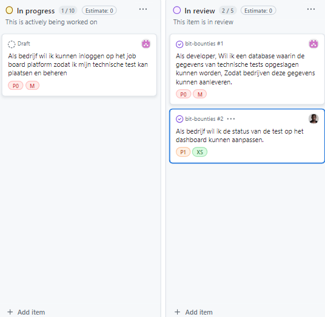
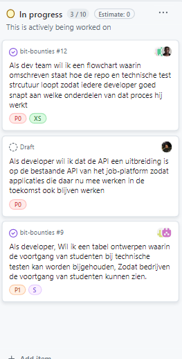
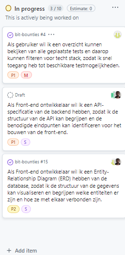
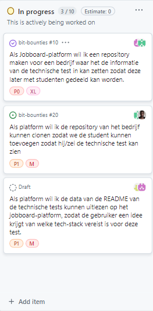

# Bit Bounties - Voortgangsbewaking

## Uitgebreide Reflectie op Voortgangsbewaking

In het Bit Bounties project hebben we een dynamische en responsieve aanpak toegepast voor projectmanagement en voortgangsbewaking. Dit zorgde voor een effectieve reactie op zowel geplande als onvoorziene uitdagingen.

### Methodieken voor Voortgangsbewaking

- **Dagelijkse Stand-ups**: Korte dagelijkse meetings waar teamleden hun voortgang bespreken en eventuele obstakels aankaarten.
- **Wekelijkse Sprint Reviews**: Bijeenkomsten aan het einde van elke sprint waar het team de voltooide taken evalueert en de doelstellingen voor de volgende sprint plant.
- **Digitaal Scrum Bord**: Continu bijgewerkt digitaal bord dat de voortgang van taken en user stories inzichtelijk maakt voor het hele team.

## Sprint Reflecties

**Sprint 1: Opzet en Fundament**
- **Focus**: Structureren van het project en opzetten van de ontwikkelomgeving.
- **Gerealiseerd**: Voltooiing van het projectplan en implementatie van de initiële technische infrastructuur.
- **Belangrijke Besluiten**: Extra tijd besteed aan het ontwikkelen van een robuust ERD.

**Sprint 2: Implementatie van Kernfunctionaliteiten**
- **Focus**: Ontwikkelen van inlogfunctionaliteiten en het opzetten van de basisdatabase.
- **Gerealiseerd**: Succesvolle implementatie van het inlogmechanisme en een veilige databasestructuur.
- **Aanpassingen**: Prioritering van het uitvoeren van een uitgebreide code review voor het inloggen en registreren.

**Sprint 3: Uitbreiding en Integratie**
- **Focus**: Uitbreiden van de applicatiefuncties en integreren van de front-end en back-end systemen.
- **Gerealiseerd**: Implementatie van aanvullende ontwerpen voor het platform
- **Strategische Keuzes**: We hebben er voor gekozen om meer tijd in te steken in de API uitbreiding.

**Sprint 4: Verfijning en Gebruikerstesten**
- **Focus**: Verfijnen van functionaliteiten en uitvoeren van uitgebreide gebruikerstests.
- **Gerealiseerd**: Optimalisatie van de gebruikersinterface en verbetering van de gebruikerservaring op basis van feedback.
- **Voortgangsbewaking**: Continu monitoren van testresultaten en direct aanpassen van de ontwikkelstrategieën op basis van deze feedback.

**Sprint 5: Repo Management en Data Uitlezing**gi 
- **Focus**: Er voor zorgen dat er een repository voor elk bedrijf word aangemaakt en dan dat kunnen clonen.
- **Gerealiseerd**: Alle primaire features bleken groter dan verwacht.
- **Besluitvorming**: Meer tijd in gestoken in de repository aanmaken story aangezien deze taak groter bleek te zijn dan verwacht. Ook omdat dit een basisfunctie is voor het platform.

