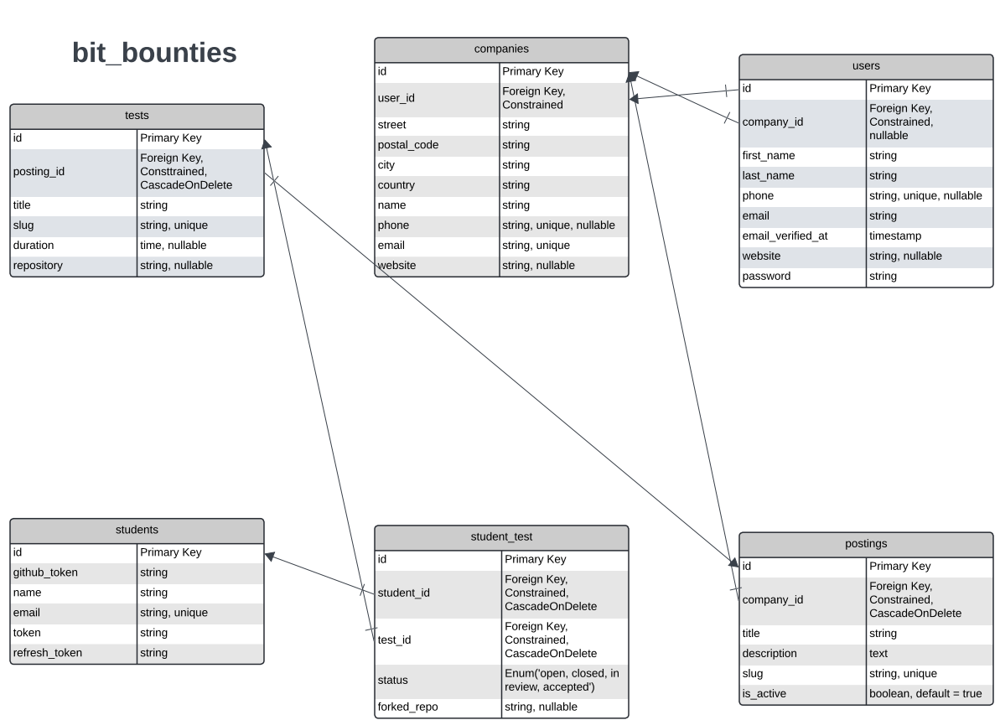
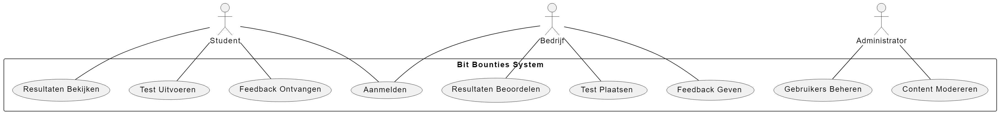

# Bit Bounties - Ontwerp en Onderbouwing

## Databae ERD
Het ERD voor Bit Bounties omvat zes entiteiten die de kernfuncties van het platform vertegenwoordigen:
- **Bedrijven**
- **Studenten**
- **Tests**
- **Postings**
- **Users**
- **Student_test**

Relaties:
- **Bedrijven** en **Tests**: 1-op-n (Een bedrijf kan meerdere tests plaatsen)
- **Bedrijven** en **Postings** 1 -op-n
(Een bedrijf kan meerdere postings hebben)
- **Tests** en **Studenten**: n-op-n (Studenten kunnen meerdere tests uitvoeren)
- **User** en **Account**: 1-op-1
(Elke user heeft één Account)

## Use Case Diagram
Ons use case diagram illustreert de interacties van drie actoren (Student, Bedrijf, Administrator) met het systeem, elk met specifieke doelen binnen de applicatie:
- **Student**: Aanmelden, Test uitvoeren, Resultaten bekijken, Feedback ontvangen
- **Bedrijf**: Aanmelden, Test plaatsen, Resultaten beoordelen, Feedback geven
- **Administrator**: Gebruikers beheren, Content modereren

## Repo Flowchart
In de docs folder van deze opdracht kan je ook een repo flowchart pdf vinden.

## Onderbouwing

### Ethiek, Privacy en Security

#### Ethiek
- **Gelijke Kansen**: We garanderen gelijke toegang tot alle beschikbare tests en kansen, ongeacht de achtergrond of locatie van de student, om eerlijke kansen in de tech-industrie te bevorderen.
- **Transparantie**: Alle gebruikers, zowel bedrijven als studenten, hebben inzicht in hoe hun data wordt gebruikt en hebben controle over hun persoonlijke informatie.

#### Privacy
- **Gegevensbescherming**: Persoonlijke gegevens van gebruikers worden versleuteld opgeslagen met behulp van de laatste encryptietechnieken om hun privacy te waarborgen.
- **Beperkte Toegang**: Strikte toegangscontroles zorgen ervoor dat alleen geautoriseerde personeelsleden toegang hebben tot gevoelige gebruikersgegevens.

#### Security
- **HTTPS**: Implementatie van HTTPS connectie voor alle data-overdracht. Zodat de website veilig is.
- **oAUTH**: 3rd party oAuth providers gebruiken om gebruikers in te laten loggen. Wij gaan hiervoor Github gebruiken.
- **Sterke Authenticatie**: Implementatie van multi-factor authenticatie (MFA) om de accounts van gebruikers beter te beveiligen tegen ongeautoriseerde toegang. We willen hiervoor een code via email sturen om in te kunnen loggen.

---