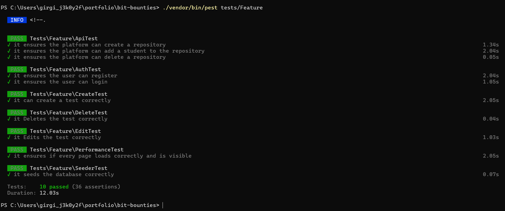

# Bit Bounties - Testrapport

## Testplan

Voor Bit Bounties hebben we gekozen voor geautomatiseerd testen met PEST, gezien de  integratie met Laravel en de gebruiksvriendelijkheid van het framework.

### Doel
Het doel van deze tests is om te verzekeren dat alle basisfunctionaliteiten van de user stories correct functioneert. Dit omvat gebruikersauthenticatie, interacties met de database, API-integraties en de algemene gebruikerservaring op het platform.

### Testcase
De test bevinden zich in de bit bountie [repository](https://github.com/praxand/bit-bounties) op github. Ook in een zip folder in deze repository. Alle tests zitten in deze folder: `\bit-bounties\tests\Feature` Hierin vind je 7 files met in totaal 10 tests:

1. **AuthTest.php**
   - **Test Registratie**: Verifieert of een gebruiker succesvol kan registreren.
   - **Test Login**: Controleert of een gebruiker kan inloggen met correcte credentials.

2. **SeederTest.php**
   - **Database Seeding**: Evalueert of de database succesvol wordt gevuld met initiële data.

3. **CreateTest.php**
   - **Aanmaken van Test/Bountie**: Test of gebruikers correct een nieuwe test/bountie kunnen aanmaken.

4. **EditTest.php**
   - **Wijzigen van Test/Bountie**: Verzekert dat wijzigingen aan een bestaande test/bountie correct worden opgeslagen.

5. **DeleteTest.php**
   - **Verwijderen van Test/Bountie**: Controleert of een test/bountie correct wordt verwijderd uit het systeem.

6. **ApiTest.php**

   **Repository Management**: Test de integratie met GitHub API voor het beheren van repositories:
   - **Aanmaken**
   - **Toevoegen van gebruikers**
   - **Verwijderen**

7. **AuthAdminTest.php**
   - **AuthAdmin**: Kijkt of de studenten niet bij de Admin pagina kunnen komen of de bedrijf pagina.

### Tests runnen
Om alle tests te runnen ga je naar de root van het project dan open je je terminal en voer je deze command uit: `./vendor/bin/pest tests/Feature`

Om alleen 1 test te runnen ga je naar de root van het project dan open je je terminal en voer je deze command uit: `./vendor/bin/pest tests/Feature/filename.php`

## Testrapport
Hieronder een screenshot van de 10 testresultaten in PEST.

    

### Rapportage

- **AuthTest.php**: Alle tests zijn geslaagd. Dit bevestigt dat zowel de registratie- als inlogfunctionaliteit correct functioneert volgens de ontworpen specificaties. Foutafhandeling is effectief, en gebruikers kunnen niet inloggen met ongeldige gegevens.
- **SeederTest.php**: De database seeding test slaagde, wat betekent dat de initiële databasestaat correct wordt opgezet voor ontwikkel- en testdoeleinden.
- **CreateTest.php**: Deze test slaagde, waardoor wordt bevestigd dat gebruikers succesvol bounties kunnen aanmaken zonder systeemfouten.
- **EditTest.php**: Deze test bevestigde dat bestaande bounties correct kunnen worden gewijzigd, en de wijzigingen worden gepersisteerd in de database.
- **DeleteTest.php**: De test voor het verwijderen van bounties was succesvol, wat aantoont dat bounties correct uit de database worden verwijderd zonder resterende data.
- **ApiTest.php**: Tests voor het beheren van repositories via de GitHub API waren succesvol, inclusief het aanmaken en verwijderen van repositories en het toevoegen van gebruikers.
- **AuthAdminTest.php**: De AuthAdminTest verliep succesvol bij de Admin gedeelte, maar we merkten wel dat bij de bedrijfspagina's je als student nogsteeds daar kon komen.

### Conclusie
De geautomatiseerde tests met PEST voor het Bit Bounties project hebben overtuigende resultaten geleverd die een goede technische realisatie van de geplande functionaliteiten laten zien. Het beoordelen van een testfase gaat echter niet alleen over het aantal tests dat succesvol is, maar ook over hoe goed het systeem presteert onder verschillende omstandigheden. Bijvoorbeeld, enkele pagina's laden wat trager. Dit heeft geleid tot verschillende belangrijke verbeterpunten die cruciaal zijn om de functionaliteit en robuustheid van het platform te verbeteren.

## Geïdentificeerde Verbeterpunten en Aanbevolen Acties

1. **AuthAdmin probleem**:
- **Probleem**: Uit de AuthAdminTest test bleek dat de Studenten bij de bedrijfspagina's konden komen. 
- **Actie**: Studenten een Student_ID meegeven en bedfrijven en bedrijven_ID

2. **Responsive gedrag onder verschillende apparaten**
- **Probleem**: Het platform is mogelijk niet geoptimaliseerd voor gebruik op verschillende apparaten.
- **Actie**: Uitvoeren van uitgebreide tests om de responsiviteit en functionaliteit van het platform op verschillende apparaten te waarborgen.

3. **Vereenvoudiging van het Registratieproces**
- **Probleem**: Het huidige authenticatieproces is complex en kan nieuwe gebruikers afschrikken.
- **Actie**: Vereenvoudiging van het registratieproces en introductie van social login mogelijkheden, zoals integratie met GitHub, om het gemakkelijker te maken voor gebruikers om zich te registreren.